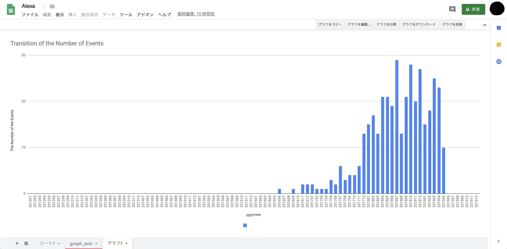

fetch-connpass-events-and-save
====


[](LICENSE) 




## Description
Fetch events on Connpass(keyword search) and save to spreadsheet.


## Requirement

[requirement.txt](./requirements.txt)


## Install

```
$ git clone git@github.com:NaotoFujihiro/fetch-connpass-events-and-save.git
$ cd fetch-connpass-events-and-save
$ pip3 install -r requirements.txt
```


## Usage

```
$ python3 main.py
Connpassで検索したいキーワードを入力してください。
コンマ区切りで複数入力できます。
入力キーワード: Python
イベントを検索する期間を指定してください。
何年何月から検索しますか？ (ex. 2012-01): 2019-01
何年何月まで検索しますか？ (ex. 2019-04): 2019-02
```

Enter the keywords and periods to search.

Now you can only select periods as `yyyy-mm`, but in the near future I will enable to enter periods as `this month`.


## Note

You need to authorize google services.

Put `credentials.json` for spreadsheet api and drive api in the `credentials` directory.

How to acquire `credentials.json`?

Please refer to this [README](./README_credentials.md)


## Future Work

1. Build Alexa skills.

    You can tell Alexa keywords and she will search events automatically.

2. Change the place to save the results.

    You can save the search results not only to spreadsheet but to somewhere else more convenient.


## Licence

[MIT](https://github.com/NaotoFujihiro/fetch-connpass-events-and-display/blob/master/LICENSE)


## Author

[Naoto Fujihiro](https://github.com/NaotoFujihiro)
